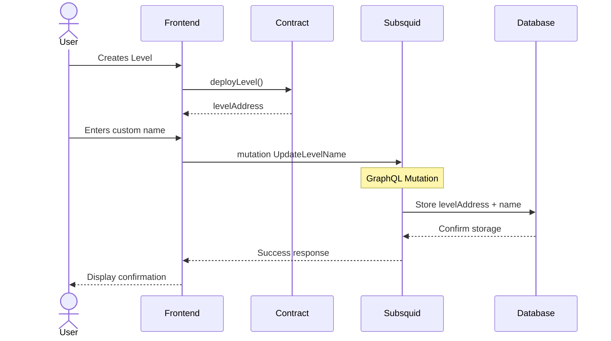
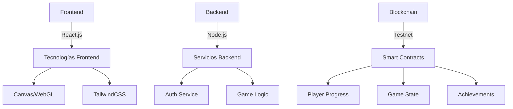

# GUCO - Plataforma Educativa de Programación para Niños

> ⚡ **NUEVO**: Ahora disponible en dos versiones - Web3 (Blockchain) y REST API (Base de datos tradicional)
> 
> 📖 Ver [DUAL_VERSION_SETUP.md](./DUAL_VERSION_SETUP.md) para configuración detallada

## devlog #1
Demo de como va, actualmente ya hacer collect de los items e implemente tone.js para sound effects

### Nuevas Implementaciones
* **Sistema de sonidos con Tone.js:**
  - Sonidos para encendido/apagado del robot
  - Efectos de sonido para movimientos
  - Sonido para recolección de objetos
  - Sonido para completar el nivel
  - Música de fondo durante el juego

* **Sistema de estados del robot:**
  - Estado 'on' (encendido) y 'off' (apagado)
  - Comandos encender() y apagar()
  - Efecto visual (escala y filtro grayscale) para robot apagado

* **Sistema de recolección:**
  - Contador de objetos recolectados
  - Verificación de recolección completa para avanzar
  - Comandos recolectar() para interactuar con objetos

* **Detección de objetivo:**
  - Verificación de posición del robot en la meta
  - Diálogo de éxito al completar el nivel

**Pendiente:**
* Actualización de progreso en blockchain al completar niveles
* Implementacion de comandos de logica, y bucles como if, else, for, while en caso de ser necesarios
* Visualización de niveles ya completados por el jugador

https://github.com/user-attachments/assets/68333b3b-0a59-4897-b9aa-942c34fb8c86

## Resumen Ejecutivo
GUCO es una plataforma web educativa diseñada para introducir a los niños en el mundo de la programación a través de una experiencia gamificada e interactiva. El proyecto busca despertar el interés por la programación desde temprana edad mediante un sistema de comandos simple pero efectivo que permite controlar un robot virtual.

## Sistema de Doble Versión

GUCO ahora soporta dos implementaciones diferentes para adaptarse a distintas audiencias y necesidades:

### 🔗 Versión Web3 (Blockchain)
- **Autenticación**: Conexión de wallet (MetaMask, etc.)
- **Almacenamiento**: Smart contracts en blockchain
- **Creación de niveles**: Requiere gas fees
- **Progreso**: Permanente en blockchain
- **Ideal para**: Usuarios con experiencia en crypto, educación sobre blockchain

### 🗄️ Versión REST API (Base de datos)
- **Autenticación**: Usuario/contraseña tradicional
- **Almacenamiento**: Base de datos Supabase
- **Creación de niveles**: Gratuito con cuenta
- **Progreso**: Almacenado en base de datos
- **Ideal para**: Usuarios nuevos, niños, instituciones educativas

### Características Comunes
- ✅ Navegar y jugar niveles sin autenticación
- ✅ Misma experiencia de juego
- ✅ Sistema de comandos idéntico
- ✅ Interfaz de usuario unificada

### Control de Versión
La versión se controla mediante variable de entorno:
```bash
# Web3 version
NEXT_PUBLIC_WEB3_ENABLED=true

# REST API version
NEXT_PUBLIC_WEB3_ENABLED=false
```

## Descripción del Proyecto

### Objetivo Principal
Crear una plataforma educativa que introduzca conceptos de programación a niños de manera divertida y accesible, fomentando el pensamiento lógico y la resolución de problemas.

### Problema que Resuelve
- Falta de recursos educativos atractivos para enseñar programación a niños
- Barrera de entrada alta para aprender programación
- Necesidad de métodos educativos más interactivos y gamificados

### Mercado Objetivo
- Niños entre 8-14 años
- Instituciones educativas primarias
- Padres interesados en educación STEM
- Profesores de computación y tecnología

## Características Técnicas

### Sistema de Comandos
```javascript
// Ejemplos de comandos básicos
moverDerecha();
moverIzquierda();
saltarArriba(1);
girar(90);
avanzar(2);
```

### Sistema de Niveles


### Arquitectura del Sistema



#### Frontend
- **Framework Principal:** React.js
- **Componentes Clave:**
  - Editor de código con resaltado de sintaxis
  - Visualizador del robot y obstáculos
  - Panel de control
  - Tablero de puntuaciones
  - Sistema de niveles

#### Backend
- **Tecnologías:**
  - Node.js + Express
  - Smart Contracts (Testnet)
  - JWT para autenticación

#### Características de Seguridad
- Autenticación segura para menores
- Control parental
- Encriptación de datos
- Moderación de contenido

## Funcionalidades Principales

### Sistema de Niveles
1. **Nivel Principiante**
   - Comandos básicos de movimiento
   - Obstáculos simples
   - Tutorial interactivo

2. **Nivel Intermedio**
   - Introducción a bucles
   - Secuencias más complejas
   - Múltiples rutas de solución

3. **Nivel Avanzado**
   - Funciones personalizadas
   - Optimización de código
   - Desafíos de lógica

### Sistema de Recompensas
- Medallas por completar niveles
- Puntos por eficiencia de código
- Insignias especiales por creatividad
- Rankings semanales y mensuales

## Plan de Implementación

### Fase 1 - MVP (3 meses)
- Sistema básico de autenticación
- 10 niveles iniciales
- Editor de código básico
- Sistema de puntuación simple
- Integración básica con blockchain

### Fase 2 - Expansión (3 meses)
- Sistema de logros en blockchain
- Niveles adicionales
- Mejoras en la interfaz
- Sistema de logros

### Fase 3 - Optimización (2 meses)
- Optimización de contratos inteligentes
- Marketing y promoción
- Optimización de retención
- Mejoras en UX/UI

## Requerimientos Técnicos

### Desarrollo
- Visual Studio Code o similar
- Git para control de versiones
- Node.js y npm
- Foundry para desarrollo de smart contracts

### Infraestructura
- AWS o similar para hosting
- CDN para contenido estático
- SSL/TLS para seguridad
- Nodo blockchain para testnet

### Testing
- Jest para pruebas unitarias
- Cypress para pruebas E2E
- Testing de usabilidad con usuarios reales

## Análisis de Riesgo y Mitigación

### Riesgos Técnicos
- **Riesgo:** Problemas de escalabilidad
- **Mitigación:** Arquitectura modular y pruebas de carga

### Riesgos de Mercado
- **Riesgo:** Baja adopción inicial
- **Mitigación:** Marketing focalizado y período de prueba gratuito

### Riesgos de Usuario
- **Riesgo:** Dificultad de uso
- **Mitigación:** Testing extensivo con grupo objetivo

## Conclusión
GUCO representa una oportunidad única para crear una plataforma educativa innovadora que combine entretenimiento con aprendizaje efectivo. Su modelo de negocio escalable y su enfoque en la experiencia del usuario la posicionan como una solución viable y sostenible en el mercado edutech.

## Métricas de Éxito
- Número de usuarios registrados
- Tasa de conversión a premium
- Tiempo promedio de sesión
- Tasa de completación de niveles
- Retención de usuarios
- Satisfacción del usuario (NPS)

## Contratos Inteligentes

GÜCO implementa funcionalidad blockchain a través de contratos inteligentes construidos con Foundry, proporcionando una gestión transparente y descentralizada del progreso y logros del juego.

### Estructura de Contratos

```
guco/
├── src/
│   ├── GucoGame.sol        # Contrato principal del juego
│   ├── interfaces/
│   │   └── IGucoGame.sol   # Interfaces del contrato
│   └── test/
│       └── GucoGame.t.sol  # Pruebas del contrato
├── script/
│   └── Deploy.s.sol        # Scripts de despliegue
└── foundry.toml            # Configuración de Foundry
```

### Características Principales

- Seguimiento de progreso de niveles
- Sistema de logros
- Estadísticas del jugador
- Creación y verificación de niveles
- Almacenamiento descentralizado del estado del juego

### Configuración de Desarrollo Local

1. Instalar Foundry:
```bash
curl -L https://foundry.paradigm.xyz | bash
foundryup
```

2. Clonar y Construir:
```bash
git clone https://github.com/your-username/guco-game
cd guco-game
forge build
```

3. Iniciar Nodo Local:
```bash
anvil
```

4. Desplegar Contratos:
```bash
forge script script/Deploy.s.sol:Deploy --rpc-url http://localhost:8545 --broadcast
```

### Pruebas de Contratos Inteligentes

Ejecutar suite de pruebas:
```bash
forge test
```

Ejecutar con verbosidad:
```bash
forge test -vv
```

### Arquitectura del Contrato

El contrato principal GucoGame gestiona:

1. Gestión de Niveles
   - Creación
   - Verificación
   - Seguimiento de completado

2. Progreso del Jugador
   - Seguimiento de logros
   - Completado de niveles
   - Estadísticas

3. Estado del Juego
   - Datos del nivel actual
   - Logros del jugador
   - Estadísticas globales

### Consideraciones de Seguridad

- OpenZeppelin's Ownable para control de acceso
- Validación de entrada para creación de niveles
- Gestión segura del estado
- Optimización de gas para funciones clave
