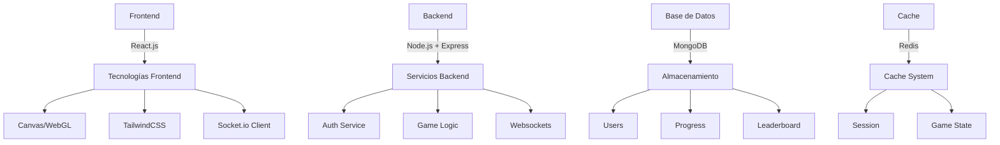

# GUCO - Plataforma Educativa de Programación para Niños

## Resumen Ejecutivo
GUCO es una plataforma web educativa diseñada para introducir a los niños en el mundo de la programación a través de una experiencia gamificada e interactiva. El proyecto busca despertar el interés por la programación desde temprana edad mediante un sistema de comandos simple pero efectivo que permite controlar un robot virtual.

## Descripción del Proyecto

### Objetivo Principal
Crear una plataforma educativa que introduzca conceptos de programación a niños de manera divertida y accesible, fomentando el pensamiento lógico y la resolución de problemas.

### Problema que Resuelve
- Falta de recursos educativos atractivos para enseñar programación a niños
- Barrera de entrada alta para aprender programación
- Necesidad de métodos educativos más interactivos y gamificados

### Mercado Objetivo
- Niños entre 8-14 años
- Instituciones educativas primarias
- Padres interesados en educación STEM
- Profesores de computación y tecnología

## Características Técnicas

### Sistema de Comandos
```javascript
// Ejemplos de comandos básicos
moverDerecha();
moverIzquierda();
saltarArriba(1);
girar(90);
avanzar(2);
```

### Arquitectura del Sistema



#### Frontend
- **Framework Principal:** React.js
- **Componentes Clave:**
  - Editor de código con resaltado de sintaxis
  - Visualizador del robot y obstáculos
  - Panel de control
  - Tablero de puntuaciones
  - Sistema de niveles

#### Backend
- **Tecnologías:**
  - Node.js + Express
  - MongoDB
  - WebSocket para actualizaciones en tiempo real
  - JWT para autenticación

#### Características de Seguridad
- Autenticación segura para menores
- Control parental
- Encriptación de datos
- Moderación de contenido

## Funcionalidades Principales

### Sistema de Niveles
1. **Nivel Principiante**
   - Comandos básicos de movimiento
   - Obstáculos simples
   - Tutorial interactivo

2. **Nivel Intermedio**
   - Introducción a bucles
   - Secuencias más complejas
   - Múltiples rutas de solución

3. **Nivel Avanzado**
   - Funciones personalizadas
   - Optimización de código
   - Desafíos de lógica

### Sistema de Recompensas
- Medallas por completar niveles
- Puntos por eficiencia de código
- Insignias especiales por creatividad
- Rankings semanales y mensuales

## Modelo de Negocio

### Plan Gratuito
- Acceso a niveles básicos
- Funcionalidades limitadas
- Publicidad no intrusiva
- Tabla de clasificación básica

### Plan Premium ($5.99/mes)
- Acceso completo a niveles
- Sin publicidad
- Robots personalizables
- Desafíos semanales especiales
- Herramientas avanzadas de debugging
- Soporte prioritario

### Plan Educativo ($49.99/mes)
- Licencias para instituciones
- Panel de control para profesores
- Seguimiento de estudiantes
- Material didáctico
- Soporte técnico dedicado
- Personalización de contenido

## Proyección Financiera

### Estructura de Ingresos
- Suscripciones Premium: 60%
- Planes Educativos: 30%
- Publicidad: 10%

### Costos Operativos
- Desarrollo y mantenimiento: 40%
- Marketing y adquisición: 25%
- Infraestructura: 20%
- Soporte al cliente: 15%

## Plan de Implementación

### Fase 1 - MVP (3 meses)
- Sistema básico de autenticación
- 10 niveles iniciales
- Editor de código básico
- Sistema de puntuación simple

### Fase 2 - Expansión (3 meses)
- Sistema de suscripciones
- Niveles adicionales
- Mejoras en la interfaz
- Sistema de logros

### Fase 3 - Monetización (2 meses)
- Implementación de planes premium
- Sistema de pagos
- Marketing y promoción
- Optimización de retención

## Requerimientos Técnicos

### Desarrollo
- Visual Studio Code o similar
- Git para control de versiones
- Node.js y npm
- MongoDB

### Infraestructura
- AWS o similar para hosting
- CDN para contenido estático
- SSL/TLS para seguridad
- Sistema de backups

### Testing
- Jest para pruebas unitarias
- Cypress para pruebas E2E
- Testing de usabilidad con usuarios reales

## Análisis de Riesgo y Mitigación

### Riesgos Técnicos
- **Riesgo:** Problemas de escalabilidad
- **Mitigación:** Arquitectura modular y pruebas de carga

### Riesgos de Mercado
- **Riesgo:** Baja adopción inicial
- **Mitigación:** Marketing focalizado y período de prueba gratuito

### Riesgos de Usuario
- **Riesgo:** Dificultad de uso
- **Mitigación:** Testing extensivo con grupo objetivo

## Conclusión
GUCO representa una oportunidad única para crear una plataforma educativa innovadora que combine entretenimiento con aprendizaje efectivo. Su modelo de negocio escalable y su enfoque en la experiencia del usuario la posicionan como una solución viable y sostenible en el mercado edutech.

## Métricas de Éxito
- Número de usuarios registrados
- Tasa de conversión a premium
- Tiempo promedio de sesión
- Tasa de completación de niveles
- Retención de usuarios
- Satisfacción del usuario (NPS)